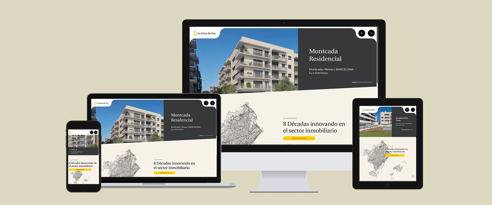

# 📌 **Resumen del proyecto**
Quien es nuestro cliente?

    Situada en Barcelona y Palma de Mallorca, La Llave de Oro es una promotora y constructora de viviendas, oficinas, locales comerciales, parkings, etc. 
    Nuestro cliente es pionero en España en la estrategia de integración de la construcción y posterior promoción de las viviendas, donde han logrado integrar todo el proceso industrial y comercial, incluyendo la compra del terreno, la urbanización, la construcción y la posterior venta individualizada. 

# 👀 **Ver proyecto**

# 🔗 **Más información**

[Swing - Parte gráfica](https://academiasanroque.com/guia-basica-sobre-componentes-de-java-swing/) 
[MVC - Modelo Vista Controlador](https://developer.mozilla.org/es/docs/Glossary/MVC) 
[Proyecto donde uso MVC](https://github.com/morenomp/First-Modelo-Vista-Controlador) 
[Uso de HashSet](https://ifgeekthen.nttdata.com/s/post/que-es-hashset-java-y-como-comenzar-con-el-MCNAUUOR4KKBE2HL575A6TGQQ7HE?language=es) 

[!IMPORTANT]
Este proyecto no busca busca nada más que ser expuesto para poder mostrarlo al jurado del curso GS Gráfica Interactiva en 2024.
